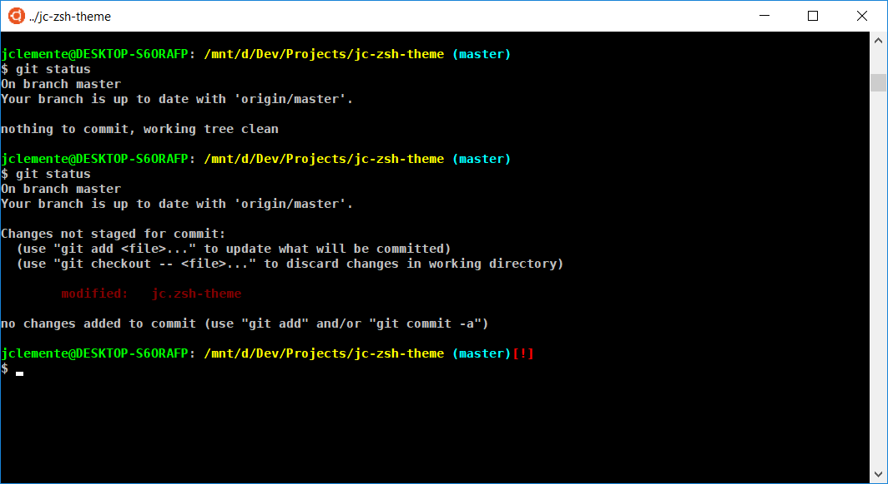

# jc-zsh-theme

Theme for [oh-my-zsh](https://github.com/robbyrussell/oh-my-zsh)

## Screenshot



## Requirements

* Z shell (zsh): See [oh-my-zsh](https://github.com/robbyrussell/oh-my-zsh) for more info.

## Installation

1. Download the theme into [oh-my-zsh](https://github.com/robbyrussell/oh-my-zsh) theme folder `~/.oh-my-zsh/custom/themes/`:

```
curl https://raw.githubusercontent.com/jclementex/jc-zsh-theme/master/jc.zsh-theme -Lo ~/.oh-my-zsh/themes/jc.zsh-theme
```

2. Configure the theme in your `~/.zshrc` file:

```
ZSH_THEME="jc"
```

3. Reload ZSH to apply the theme:

```
source ~/.zshrc
```